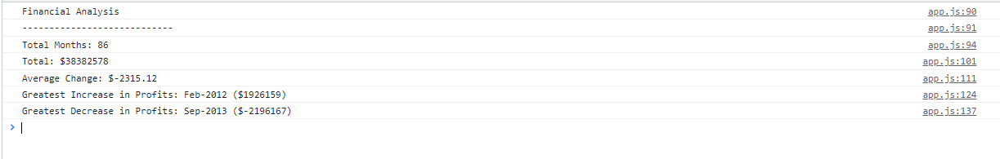

# Console-Finances
## Description
This project aims to provide a comprehensive financial analysis of a company's profits and losses over a certain period of time. The analysis includes calculating the total number of months, the net total amount of profits/losses, the average change in profits/losses, and the greatest increase and decrease in profits/losses.

The motivation for this project was to create a tool that can quickly and accurately analyze a company's financial performance. This project was built to solve the problem of having to manually calculate and analyze financial data, which can be time-consuming and prone to errors. By automating this process, the project aims to save time and improve the accuracy of financial analysis.

Through the development of this project, I learned how to use JavaScript to iterate through arrays, calculate sums and averages, and find the maximum and minimum values.

https://nowinoa.github.io/Console-Finances/

## Table of Contents
- Installation
- Usage
- Credits
- License

## Installation
To use this financial analysis tool, follow these steps:

Clone or download this repository.
Open the index.html file in a web browser.
The financial analysis will be displayed in the console.

## Usage
To use this financial analysis tool, follow these steps:

- Open the index.js file in a text editor.
- Update the finances array with your own financial data, following the same format as the example provided. Each element in the array should contain a month and year in the first position (as a string) and the corresponding profit/loss value in the second position (as a number).
- Save the index.js file.
- Open the index.html file in a web browser.
- The financial analysis will be displayed in the console.

## Credits
This financial analysis tool was developed by Ainhoa Prada.

## License
This project is licensed under the MIT License. This means that you are free to use, modify, and distribute the code for any purpose, as long as you include the MIT License in your distribution.
